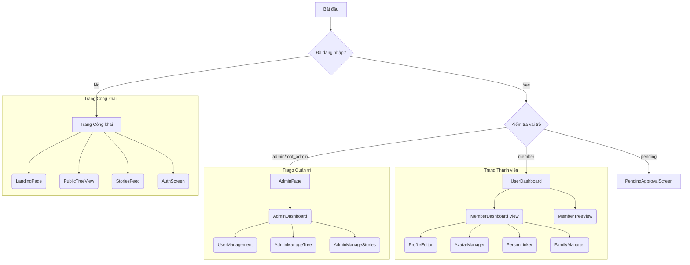

# Tài liệu Kỹ thuật: Website Gia Phả Dòng Họ Phạm

## 1. Tổng quan

Tài liệu này mô tả chi tiết về kiến trúc, cấu trúc layout, luồng dữ liệu, và các kỹ thuật được áp dụng trong dự án website gia phả. Mục tiêu của dự án là tạo ra một không gian số để kết nối, lưu trữ và quản lý thông tin gia phả của dòng họ Phạm.

- **Công nghệ chính:** React, Vite, Tailwind CSS, Firebase (Authentication, Firestore, Storage).
- **Thư viện nổi bật:** `react-d3-tree` để trực quan hóa cây gia phả.

---

## 2. Cấu trúc Layout & Sơ đồ Trang

Ứng dụng được xây dựng theo mô hình Single-Page Application (SPA). Component `App.jsx` đóng vai trò là "bộ định tuyến" chính, quản lý việc hiển thị các trang dựa trên trạng thái đăng nhập của người dùng và quyền hạn (role).

### Sơ đồ các trang (Pages)

### Mô tả các Component chính trong mỗi Page

| Page / View | Component chính | Mô tả |
| :--- | :--- | :--- |
| **LandingPage** | `LandingPage.jsx` | Trang giới thiệu tĩnh, mô tả các tính năng chính của website. |
| **PublicTreeView** | `PublicTreeView.jsx` | Hiển thị cây gia phả công khai, chỉ đọc. Sử dụng `react-d3-tree`. |
| | `PersonsTable.jsx` | Chế độ xem dạng bảng của cây gia phả. |
| | `TreeViewHeader.jsx` | Thanh công cụ chứa bộ lọc, tìm kiếm, chuyển đổi chế độ xem. |
| **StoriesFeed** | `StoriesFeed.jsx` | Hiển thị danh sách các tin tức, câu chuyện của dòng họ. |
| **AuthScreen** | `AuthScreen.jsx` | Form đăng nhập và đăng ký cho người dùng. |
| **AdminPage** | `Admin.jsx` | Trang quản trị chính, điều hướng đến các trang con. |
| | `UserManagement` | Quản lý tài khoản người dùng, phân quyền, liên kết `user` với `person`. |
| | `AdminManageTree` | Giao diện CRUD (Thêm, Sửa, Xóa) cho các thành viên trong gia phả. |
| | `PersonEditor` | Form chi tiết để chỉnh sửa thông tin một thành viên. |
| | `AdminManageStories` | Giao diện CRUD cho các bài đăng, tin tức. |
| **UserDashboard** | `UserDashboard.jsx` | Bảng điều khiển cho thành viên đã đăng nhập. |
| | `ProfileEditor` | Cho phép thành viên tự chỉnh sửa thông tin cá nhân. |
| | `AvatarManager` | Cho phép thành viên thay đổi ảnh đại diện. |
| | `PersonLinker` | Giúp thành viên liên kết tài khoản của họ với một hồ sơ có sẵn trong cây. |
| | `FamilyManager` | Giúp thành viên quản lý các mối quan hệ gia đình trực tiếp (vợ/chồng, con). |
| **PendingApproval**| `PendingApprovalScreen.jsx` | Màn hình thông báo cho người dùng mới đăng ký và đang chờ duyệt. |

---

## 3. Cấu trúc Dữ liệu (Firestore)

Ứng dụng sử dụng 4 collection chính trong Firestore:

### a. `persons`
Lưu trữ thông tin của từng cá nhân trong gia phả.

- **id**: (string) Document ID, định danh duy nhất.
- **name**: (string) Họ và tên.
- **nickname**: (string) Tên thường gọi.
- **gender**: (string) `male` | `female` | `other`.
- **birthDate**: (string) Ngày sinh (định dạng YYYY-MM-DD).
- **deathDate**: (string) Ngày mất (định dạng YYYY-MM-DD, có thể null).
- **isDeceased**: (boolean) Trạng thái còn sống/đã mất.
- **fatherId**: (string) Document ID của người cha trong collection `persons`.
- **motherId**: (string) Document ID của người mẹ trong collection `persons`.
- **currentAddress**: (string) Nơi sinh sống hiện tại.
- **contact**: (object) Thông tin liên hệ.
    - **facebook**: (string) Tài khoản Facebook.
    - **personalEmail**: (string) Email cá nhân.
    - **phone**: (string) Số điện thoại.
- **achievements**: (string) Thành tựu, thành tích nổi bật.
- **profilePictureUrl**: (string) URL ảnh đại diện (lưu trên Firebase Storage).
- **biography**: (string) Tiểu sử, ghi chú.
- **generation**: (number) Số thứ tự thế hệ (đời).

### b. `users`
Lưu trữ thông tin tài khoản đăng nhập.

- **id**: (string) Document ID, trùng với `uid` của Firebase Authentication.
- **email**: (string) Email đăng nhập.
- **displayName**: (string) Tên hiển thị.
- **role**: (string) Quyền hạn: `root_admin`, `admin`, `member`, `pending`.
- **personId**: (string) Document ID của hồ sơ tương ứng trong collection `persons`. Đây là liên kết quan trọng.

### c. `unions`
Lưu trữ mối quan hệ hôn nhân. Cấu trúc này giúp đơn giản hóa việc truy vấn và xây dựng cây.

- **husbandId**: (string) Document ID của người chồng trong `persons`.
- **wifeId**: (string) Document ID của người vợ trong `persons`.

### d. `stories`
Lưu trữ các bài đăng, tin tức.

- **title**: (string) Tiêu đề bài viết.
- **content**: (string) Nội dung.
- **authorId**: (string) `uid` của người đăng bài.
- **createdAt**: (Timestamp) Thời gian đăng.
- **coverImageUrl**: (string) URL ảnh bìa.
- **taggedPersons**: (array) Mảng các `personId` được gắn thẻ trong bài viết.

---

## 4. Logic và Kỹ thuật áp dụng

### a. Xây dựng cây gia phả (`buildTree`)
- **Vị trí:** `src/utils/treeUtils.js`
- **Logic:** Đây là thuật toán cốt lõi. Nó nhận vào hai mảng dữ liệu phẳng (`persons` và `unions`) và chuyển đổi chúng thành một cấu trúc cây phân cấp (nested object) mà thư viện `react-d3-tree` có thể đọc được.
    1.  Tạo một `Map` để truy cập nhanh thông tin mỗi người (`personMap`).
    2.  Duyệt qua `personMap`, dựa vào `fatherId` và `motherId` để xây dựng liên kết cha-con, đẩy các node con vào mảng `children` của node cha.
    3.  Xác định các node gốc (root nodes) - là những người không phải là con của ai cả.
    4.  Duyệt qua collection `unions` để thêm thông tin vợ/chồng (`spouses`) vào từng node.
    5.  Gán số thứ tự thế hệ (`generation`) một cách đệ quy, bắt đầu từ các node gốc.
    6.  Trả về một node gốc duy nhất hoặc một node "siêu gốc" nếu có nhiều nhánh gia phả riêng biệt.

### b. Quản lý trạng thái (State Management)
- Ứng dụng chủ yếu sử dụng React Hooks (`useState`, `useEffect`) để quản lý trạng thái cục bộ của component.
- Trạng thái toàn cục (như thông tin người dùng đăng nhập) được quản lý ở component `App.jsx` và truyền xuống các component con qua props.
- Dữ liệu từ Firestore được lắng nghe theo thời gian thực bằng `onSnapshot`, giúp giao diện tự động cập nhật khi có thay đổi trên server.

### c. Phân quyền (Authorization)
- Quyền hạn được kiểm soát thông qua trường `role` trong collection `users`.
- `App.jsx` đọc `role` của người dùng sau khi đăng nhập và hiển thị giao diện tương ứng (Admin, User, hoặc Pending).
- Các quy tắc bảo mật của Firestore (`firestore.rules`) cần được cấu hình chặt chẽ để đảm bảo người dùng chỉ có thể đọc/ghi dữ liệu mà họ được phép.

### d. Tối ưu hóa hình ảnh
- Component `PublicTreeView.jsx` chứa logic để yêu cầu các phiên bản ảnh đã được thay đổi kích thước từ Firebase Storage (ví dụ: `_40x40`, `_200x200`). Điều này giúp cải thiện đáng kể tốc độ tải trang bằng cách không phải tải ảnh gốc có dung lượng lớn. Kỹ thuật này yêu cầu một Firebase Extension như "Resize Images" để tự động tạo các phiên bản ảnh.

---

## 5. Gợi ý và các bước hoàn thiện

### a. Cần triển khai ngay
1.  **Hoàn thiện `FamilyManager`:** Component này cần có giao diện cho phép thành viên thêm vợ/chồng hoặc con cái. Dữ liệu này có thể được ghi vào một collection "đề xuất" (`proposed_changes`) để admin duyệt, hoặc tạo trực tiếp nhưng với một cờ `is_approved: false`.
2.  **Hoàn thiện `ProfileEditor` của thành viên:** Cần xác định rõ những trường nào thành viên được phép tự sửa. Các thay đổi quan trọng (như ngày sinh) có thể cần admin duyệt.
3.  **Triển khai `firestore.rules`:** Đây là bước **cực kỳ quan trọng** để bảo mật ứng dụng. Cần định nghĩa các quy tắc chi tiết, ví dụ:
    -   Chỉ admin mới được ghi vào collection `users`.
    -   Thành viên chỉ được sửa document trong `persons` có `id` trùng với `personId` của họ.
    -   Mọi người đều có thể đọc `persons` và `stories`, nhưng chỉ thành viên mới được đọc các trường nhạy cảm.
4.  **Cài đặt Firebase Extension "Resize Images":** Để tính năng tối ưu hóa hình ảnh hoạt động, cần cài đặt và cấu hình extension này trên Firebase project.

### b. Gợi ý cải tiến
1.  **Lazy Loading cho cây gia phả:** Hiện tại, ứng dụng tải toàn bộ collection `persons` và `unions` một lúc. Với gia phả lớn, điều này sẽ gây chậm. Cần cải tiến để chỉ tải node gốc ban đầu, sau đó tải thêm các node con khi người dùng mở rộng một nhánh cụ thể.
2.  **Tìm kiếm nâng cao:** Bổ sung các bộ lọc tìm kiếm mạnh hơn (ví dụ: tìm theo khoảng năm sinh, tìm người không có con, tìm theo quê quán...).
3.  **Trang chi tiết thành viên (`ProfilePage.jsx`):** Xây dựng một trang profile hoàn chỉnh cho mỗi người, hiển thị tiểu sử, hình ảnh, dòng thời gian sự kiện, và các mối quan hệ gia đình một cách trực quan.
4.  **Thông báo (Notifications):** Xây dựng hệ thống thông báo trong ứng dụng (ví dụ: khi một thành viên mới được duyệt, khi có bình luận về một câu chuyện, khi có người trả lời bình luận của bạn).
5.  **Tương tác cộng đồng:** Cho phép thành viên bình luận về các bài đăng trong `StoriesFeed`, tạo ra một không gian thảo luận sôi nổi hơn.
6.  **Cải thiện UI/UX:**
    -   Thêm hiệu ứng chuyển động (animations) để giao diện mượt mà hơn.
    -   Tối ưu hóa hiển thị trên các thiết bị di động, đặc biệt là giao diện cây gia phả.
    -   Thêm chế độ ban đêm (Dark Mode).
